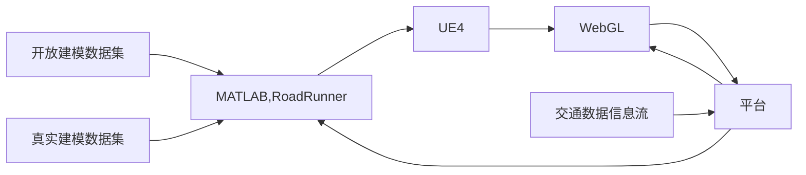

# 目前事项

1）初步确定平台开发的技术架构

2）学习交通场景数字孪生的软件开发相关技术

3）初步确定平台的数据模型内容与界面展示

# 项目架构

Springboot、Vue、Mysql、Mybatis-Plus、数字孪生

openstreemap、WebGL、three.js、vue-baidu-map

# 业务逻辑

> 宏观层

> 中间层

> 微观层

# 效果参考

# 后续考虑

## 孪生组成

数字孪生 --> 基底数据 + 场景模型

## 数据接入

1）实时视频：支持实时视频接入； 

2）交通参与者：支持交通参与者接入（机动车、非机动车、行人）并对轨迹做平滑做 处理； 

3）信号灯：支持信号灯实时数据接入； 

4）交通事件接入：基于点坐标的去重/聚合服务，如交通事件去重/聚合； 

5）多源数据对齐：支持多源数据时间对齐

## 百度开发工具

- 三维场景可视化MapV Three
- 数据可视化MapV GL
- 鼠标绘制库BMap Draw
- 微信小程序JavaScript API
- 地铁图JavaScript API
- React-BMapGL（JSAPI）
- 个性化地图编辑器
- 地理信息可视化平台

