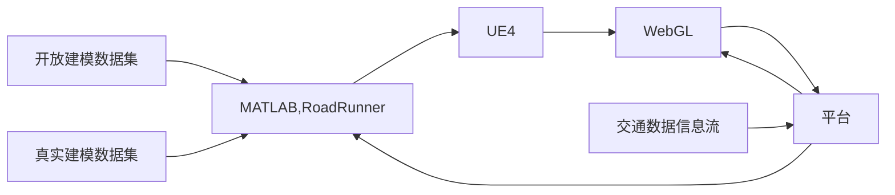

# 目前事项

1）初步确定平台开发的技术架构

2）学习交通场景数字孪生的软件开发相关技术

3）初步确定平台的数据模型内容与界面展示

# 项目架构

Springboot、Vue、Mysql、Mybatis-Plus、数字孪生

openstreemap、WebGL、three.js、vue-baidu-map

# 业务逻辑

# 效果参考

# 数据库设计

根据城市交通规划对数据的要求清空，空间数据库的存储按照点、线、面三个层次进行，每个层次按照描述的对象又分为若干层次。

### 点层要素

点层要素主要描述城市路网交通特征点的基本情况及交通情况。比如道路路网节点、典型建筑小区、交叉路口、公交站点等。

- ID 路网节点主键
- NAME 路网节点名称（公交站点名称）
- CODE 路网节点编码
- X 节点X坐标
- F 节点Y坐标
- Type 节点类型

### 线层要素

线层要素主要描述的是城市交通网络中的线路情况。如一条完成的道路，一条公交线路，一条道路路段等。路段的空间数据表示路段的空间位置，表达了路段的集合特征。

- ID 路段主键
- NAME 道路名称
- START_POINT 道路起点编号
- END_POINT 道路重点编号

### 面层要素

面层要素用于描述交通小区、行政区、土地利用等信息。

- ID 面层主键
- CODE 大区编号+小区编号
- AREA 各小区的面积
- LAND_USE_TYPE 用地类型：行政办公、市政用地、商业金融、居住用地、教育科研

### 具体层级设计（tx）

市 -- 行政区 -- 区域 -- 道路 -- 路段 -- 路口 

#### 道路属性查询

request

| 名称   | 描述         | 位置 | 类型   | 必选 | 说明 |
| ------ | ------------ | ---- | ------ | ---- | ---- |
| idList | 道路Id集合   | body | string | 是   |      |
| adcode | 行政区adcode | body | string | 是   |      |

response

| 名称             | 类型     | 中文名                       | 说明                                                         |
| ---------------- | -------- | ---------------------------- | ------------------------------------------------------------ |
| status           | integer  | 状态码                       | 0：正常；非0：异常                                           |
| roadId           | string   | 道路id                       |                                                              |
| name             | string   | 道路名称                     |                                                              |
| adcode           | string   | 行政区id                     |                                                              |
| dir              | int      | 通行方向                     | 1：双向同行，2：顺向通行                                     |
| len              | int      | link长度                     |                                                              |
| rc               | int      | 道路等级                     | 枚举值 0：高速路,1：都市高速路,2：国道,3： 省道,4：县道,6：乡镇村道,8：其它道路； 9：九级路 非引导道路,10：轮渡,11：行 人道路,12：人渡 |
| startCrossId     | string   | 道路起点 crossId             |                                                              |
| endCrossId       | string   | 道路终点 crossId             |                                                              |
| coordinatePoints | GeoPoint | 路段对应的坐标信息（经纬度） |                                                              |

#### 态势感知查询相关参数

request

| 名称                | 描述                                                         | 位置 | 类型     | 必选 | 说明 |
| ------------------- | ------------------------------------------------------------ | ---- | -------- | ---- | ---- |
| adcodeList          | 行政区 id 列表                                               | body | string   | 是   |      |
| spaceTypeList       | 路况类型，3-路段，4-道路，5- 区域，6-道路类型，7-自定义区域  | body | string   | 是   |      |
| spaceIdList         | spaceType=3 表示路段 id 列表， spaceType=4 表示道路 id 列表， spaceType=5 表示区域 id 列表, spaceType=7 表示自定义区域 id 列 表， spaceType=6 时 ，表示 link rc 道路 类型 ，则 spaceId 取值 ： space_id="high_way"，(为高速路) space_id="trunk_road"，为主干路 space_id="secondary_road"，(为次干路） | body | string[] | 是   |      |
| timeStrList         | 时间片段列表 ["0350","0355"]                                 | body | string[] | 是   |      |
| timeIntervalList    | 时间粒度，单位秒 300,3600                                    | body | int[]    | 是   |      |
| tpiStatusList       | 拥堵状况，0 表示畅通，1 表示缓 行，2 表示拥堵，3 表示严重拥  | body | int[]    | 是   |      |
| isNormalJamList     | 是否常发拥堵，0：突发，1：常发, 2:未拥堵                     | body | int[]    | 是   |      |
| rcList              | 道路等级,0：高速路,1：都市高速 路,2：国道,3：省道,4：县道,6：乡 镇村道,8：其它道路 数据存储都是 rc=0 | body | int[]    | 是   |      |
| dtList              | 日期 [20220713,202207]                                       | body | string[] | 是   |      |
| conditionsOrderType | 排序类型，0-不排序 1-拥堵里程，2-拥堵里程占比，3- 拥堵时间，4-拥堵指数，5-平均速 度，6-畅行速度 20-综合指数 | body | int      | 是   |      |
| pageNum             | 页号                                                         | body | int      | 是   |      |
| pageSize            | 每页数量                                                     | body | int      | 是   |      |

#### 历史数据查询

request

| 名称        | 描述         | 位置 | 类型    | 必选 | 说明                                                        |
| ----------- | ------------ | ---- | ------- | ---- | ----------------------------------------------------------- |
| id          | 区域ID       | body | string  | 是   | 区域申请审核通过后分配的 id                                 |
| begin       | 开始时间     | body | integer | 是   | unix 时间戳，整点开始整点结束， 时间跨度不超过 2 天         |
| end         | 结束时间     | body | integer | 是   | unix 时间戳，整点开始整点结束， 时间跨度不超过 2 天         |
| interval    | 时间间隔粒度 | body | integer | 是   | 单位：分钟。取值：5，10，30，60                             |
| people_type | 人口类型     | body | string  | 否   | 不填默认为"all"。all：全部人口（常驻+流动），flow：流动人口 |
| key         | 开发密钥     | body | string  | 是   | 无                                                          |

response

| 名称    | 类型          | 中文名   | 说明                                                         |
| ------- | ------------- | -------- | ------------------------------------------------------------ |
| status  | integer       | 状态码   | 0：正常；非0：异常                                           |
| message | string        | 状态说明 |                                                              |
| data    | array<object> | 数据体   |                                                              |
| »time   | 时刻          | string   | 格式：YYYY-MM-DD HH:MM:SS                                    |
| »value  | 实时人数      | integer  | 当 0＜人数＜100 时，value 按 20 一档输 出，此时会出现 info 字段，用于说明真实 数值区间。取值及含义如下： "＜20"：人数＜20，value 为 0， "20-40"：20≤人数＜40，value 为 20， "40-60"：40≤人数＜60，value 为 40， "60-80"：60≤人数＜80，value 为 60， "80-100"：80≤人数＜100，value 为 80 |
| »info   | 结果说明      | string   |                                                              |

路段和道路存在以下区别：

1. 范畴：道路是一个更广泛的术语，可以包括连接城市、乡村和工矿基地的整条路，而路段是道路的一部分，通常介于两个交叉路口之间。
2. 技术标准：道路通常具有明确的技术标准和设施，以支持车辆行驶。

所以，总的来说，道路是一个更广泛的概念，而路段是道路的一部分。

# 计划

### 基础

本地环境都搭建 、 代码结构、 数据库 、 腾讯的文档

### 角色

系统管理员、用户、...

### 前端

百度地图离线实现 https://blog.csdn.net/qq_53513969/article/details/128577624

针对后端已经写好的接口，添加菜单+编写界面

### 后端

数据库表设计

- 市 -- 行政区 -- 区域 -- 道路 -- 路段 -- 路口
- 指标相关（统一标准、已初步完成，可以插入一些常用指标数据）

基础数据的导入

- openstreetMap下载，arcGis数据转换导出(ccl)
- Matlab对接UE虚幻引擎的仿真，导出为webgl（其他组）

### 假数据

模拟数据

# 后续考虑

## 孪生组成

数字孪生 --> 基底数据 + 场景模型

## 数据接入

1）实时视频：支持实时视频接入； 

2）交通参与者：支持交通参与者接入（机动车、非机动车、行人）并对轨迹做平滑做 处理； 

3）信号灯：支持信号灯实时数据接入； 

4）交通事件接入：基于点坐标的去重/聚合服务，如交通事件去重/聚合； 

5）多源数据对齐：支持多源数据时间对齐

## 百度开发工具

- 三维场景可视化MapV Three
- 数据可视化MapV GL
- 鼠标绘制库BMap Draw
- 微信小程序JavaScript API
- 地铁图JavaScript API
- React-BMapGL（JSAPI）
- 个性化地图编辑器
- 地理信息可视化平台

